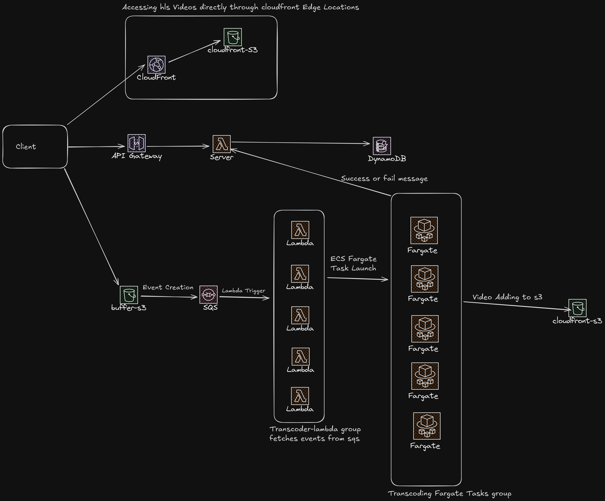

# 📖 StreamBridge – Video Sharing Website 🚀

StreamBridge is a platform that allows users to upload videos and receive an HLS-formatted URL for efficient streaming. Users can view, share, and manage their videos seamlessly.

## 📌 Features

- ✅ Upload videos and receive an optimized streaming URL.
- ✅ Supports HLS (HTTP Live Streaming) for smooth playback.
- ✅ Adaptive Bitrate Streaming.
- ✅ Secure and scalable architecture using AWS services.
- ✅ Share video links easily with others.
- ✅ Efficient serverless processing for video encoding.

## 🛠 Setup & Installation

### 1️⃣ Clone the Repository

To get started, clone the repository using:

```bash
git clone https://github.com/your-username/StreamBridge.git
cd streambridge
```

### 2️⃣ Install Dependencies

Make sure you have Node.js (18+), Docker, and AWS CLI installed. Then, install dependencies:

```bash
npm install
```

### 3️⃣ Set Up Environment Variables

Rename `.env.example` to `.env` and update it with your AWS and database credentials.

### Frontend:

    NEXT_PUBLIC_SERVER_URL

### Backend Server:

    S3_BUFFER_BUCKET
    S3_BUCKET
    CLOUDFRONT_URL
    ADMIN_CODE
    PORT=5000
    STREAMBRIDGE_EMAIL_PASSWORD
    COGNITO_USER_POOL_ID
    COGNITO_CLIENT_ID

### Transcoder

    UPLOAD_BUCKET
    BUFFER_BUCKET
    SERVER_URL
    ADMIN_CODE

### 4️⃣ Start the Application

Run the backend service:

```bash
npm run dev
```

The app will be available at [http://localhost:5000](http://localhost:5000).

Run the frontend service:

```bash
npm run dev
```

The app will be available at [http://localhost:3000](http://localhost:3000).

### 5️⃣ Run the Transcoder

```bash
docker-compose up
```

To enable automatic video transcoding, you need to deploy the transcoder as an ECS Task and a Lambda function. The transcoding process can be triggered automatically using an S3 event trigger, which executes the Lambda function whenever a new video is uploaded.

## 🎥 How It Works

1. **Upload a Video** – Users upload their videos through the website.
2. **Video Processing** – The backend converts the video to HLS format.
3. **Get Stream URL** – The user receives an HLS streamable URL.
4. **Watch & Share** – The video can be played directly or shared with others.

---

Feel free to contribute and enhance StreamBridge! 🚀

# Backend Architecture


